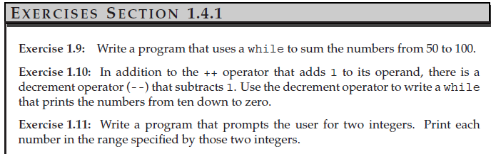
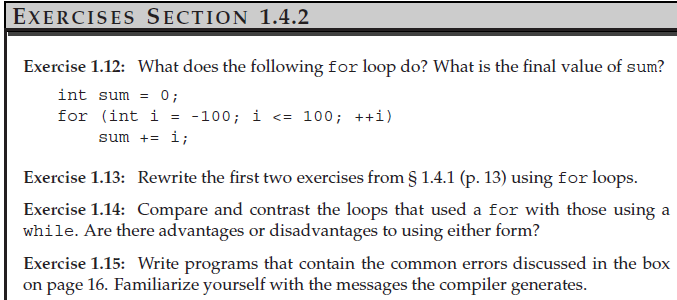
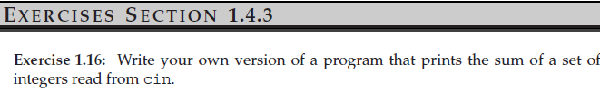
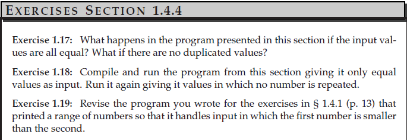
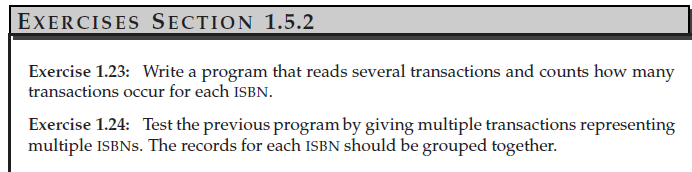

**1.1**

MinGW, .cpp

**1.2**

The program run normally


**1.3**

```cpp
#include<iostream>

int main()
{
    return 0;
}
    std::cout << "hello world";
```

**1.4**

```cpp
#include<iostream>

int main()
{
    int v1,v2;
    std::cin >> v1 >> v2;
    std::cout << "The product of " << v1 << " and " << v2
    <<" is " << v1 * v2 << std::endl;

    return 0;
}
```

**1.5**

```cpp
#include<iostream>

int main()
{
    int v1,v2;
    std::cin >> v1 >> v2;

    std::cout << "v1 = " << v1 << std::endl;
    std::cout << "v2 = " << v2 << std::endl;
    std::cout << "The product of v1 and v2 is: " << v1*v2 << std::endl;

    return 0;
}
```

**1.6**

The semicolons shouldn't be there if the cout command hadn't finished.
```cpp
std::out << "The sum of "<< v1
<< " v2 " << v2
<< " is " << v1+v2 <<std::endl;

```


**1.7**

 error: expected primary-expression before '/' token */

**1.8**

```cpp
#include<iostream>

int main(){
    std::cout << "/*";
    std::cout << "*/";
    //std::cout << /*"*/" */;            //only this one cannot correctly compile
    std::cout << /* "*/" /* "/*" */;    
   return 0;
}
```



**1.9**

```cpp
#include<iostream>
using namespace std;

int main()
{
    int val = 50, sum = 0;
    while(val <= 100)
    {
        sum += val;
        val++;
    }
    cout << "The sum of 50 to 100 inclusive is " << sum << endl;
    
    return 0;
}
```

**1.10**

```cpp
#include<iostream>
using namespace std;

int main()
{
    int val = 10;
    while(val >= 0)
    {
        cout << val << endl;
        val--;
    }
    
    return 0;
}
```

**1.11**

```cpp
#include<iostream>
using namespace std;

int main()
{
    int start, end;
    cout << "enter two numbers: " << endl;
    cin >> start >> end;
    cout << endl;
    if(start > end)
    {
        while (start >= end)
        {
            cout << start << endl;
            start--;
        }
    }
    else
    {
        while (start <= end)
        {
            cout << start << endl;
            start++;
        }
    }

    return 0;
}
```



**1.12**

(1) store the sum of -100 to 100 in the variable named 'sum'

(2) 0

**1.13**

```cpp
#include <iostream>
int main()
{
int sum = 0;

for (int val = 1; val <= 10; val++)
{
    sum += val;
}
std::cout << "Sum of 1 to 10 inclusive is "
<< sum << std::endl;
return 0;
}
```

**1.14**

for loop is more clear and convenient, while while loop is more flexible while the number of iterations is not fixed

**1.15**

```cpp
#include<iostream>
// error: missing ) in parameter list for main
int main () {
// error: used colon, not a semicolon, after endl
std::cout << "Read each file." << std::endl;
// error: missing quotes around string literal
std::cout << "Update master." << std::endl;
// error: second output operator is missing
std::cout << "Write new master." << std::endl;
// error: missing ; on return statement
return 0;
}
```

**1.16**
```cpp
#include <iostream>
using namespace std;

int main()
{
    int sum = 0, value;
    while(cin >> value)
    {
        sum += value;
    }
    cout << "The sum of the inputs is " << sum << endl;

    return 0;
}
```

**1.17**

1. cnt will be the number of numbers
2. every input num will be printed "num occur 1 times" 

**1.19**

I amended the program to store the max of inputs and min of inputs, and output the input range int the end. 
```cpp
#include <iostream>

int main()
{
    // currVal is the number we’re counting; we’ll read new values into val
    int currVal = 0, val = 0, max, min;
    // read first number and ensure that we have data to process
    if (std::cin >> currVal)
    {
        int cnt = 1; // store the count for the current value we’re processing
        max = currVal;
        min = currVal;
        while (std::cin >> val)
        {                       // read the remaining numbers
            if (val == currVal) // if the values are the same
                ++cnt;          // add 1 to cnt
            else
            { // otherwise, print the count for the previous value
                std::cout << currVal << " occurs "
                          << cnt << " times" << std::endl;
                currVal = val; // remember the new value
                cnt = 1;       // reset the counter
                if(currVal > max)
                    max = currVal;
                else if(currVal < min)
                    min = currVal;
            }
        } // while loop ends here
        // remember to print the count for the last value in the file
        std::cout << currVal << " occurs "
                  << cnt << " times" << std::endl;
    } // outermost if statement ends here
    std::cout << "The input range is between " << min << " and " << max << std::endl;
    return 0;
}
```

**1.20**

```cpp
#include <iostream>
#include "Sales_item.h"

int main()
{
    Sales_item book;
    while(std::cin >> book)
    {
        std::cout << book << std::endl;
    }

    return 0;
}
```

**1.21**
```cpp
#include <iostream>
#include "Sales_item.h"

int main()
{
    Sales_item book1, book2;
    std::cin >> book1 >> book2;
    
    if(book1.isbn() == book2.isbn())
        std::cout << book1 + book2 << std::endl;
    

    return 0;
}
```
**1.22**
```cpp
#include <iostream>
#include "Sales_item.h"
using namespace std;

int main()
{
    Sales_item book, sum;
    std::cin >> sum;
    while (std::cin >> book)
    {
            sum += book;
    }
    cout << sum << endl;

    return 0;
}
```


**1.23**
```cpp
#include<iostream>
#include"Sales_item.h"

/* count each identity isbn transcation, the input isbn must be ascending*/
int main(){
    Sales_item trans, total;
    if (std::cin >> total)
    {
        while(std::cin >> trans)
        {
            if(trans.isbn() == total.isbn())
            {
                total += trans;
            }
            else
            {
                std::cout << "The total sales:" << total << std::endl;
                total = trans;
            }
        }
        std::cout << "The total sales:"<< total << std::endl;
    }

    return 0;
}
```

**1.24** (skip)

**1.25** the modified version of ex1.23. (skip)