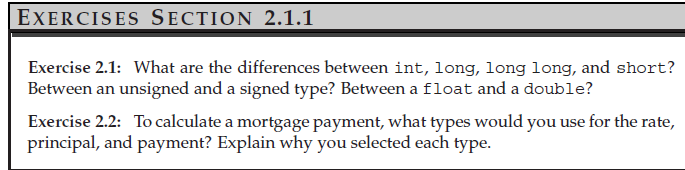

**2.1**

### Integer Types and Their Ranges

- **(Signed) `int`** can hold integers in the range $-2^{31}$ to $2^{31} - 1$ (i.e., -2,147,483,648 to 2,147,483,647). This is the most frequently used integer type due to its balanced range and size.

- **`short`** often holds integers in the size of 2 bytes (16 bits), which can store values in the range $-2^{15}$ to $2^{15} - 1$ (i.e., -32,768 to 32,767). This range is relatively small, so `short` is less commonly used in modern applications where larger ranges are typically needed.

- **`long`** is often the same size as `int` on modern 64-bit machines, typically 4 bytes (32 bits), but this can vary depending on the machine and compiler. On some systems, `long` may be 8 bytes (64 bits). It is essential to check the specific implementation on your target platform.

- **`long long`** can hold integers in the size of 8 bytes (64 bits), providing a much larger range from $-2^{63}$ to $2^{63} - 1$ (i.e., -9,223,372,036,854,775,808 to 9,223,372,036,854,775,807). You can use `long long` when you need to store very large integer values.

```
Size of short: 2 bytes
Range of short: -32768 to 32767

Size of int: 4 bytes
Range of int: -2147483648 to 2147483647

Size of long: 4 bytes
Range of long: -2147483648 to 2147483647

Size of long long: 8 bytes
Range of long long: -9223372036854775808 to 9223372036854775807
```
In summary:

int is the most commonly used integer type.
short is less commonly used due to its small range.
long may be the same size as int on many systems but can vary.
long long is used when very large integers are required.

If you are sure your integer is not negative, you can use `unsigned int`.

`char` also has an implicit signed/unsigned type depending on the machine, so it's better not to perform arithmetic operations on them.

`float` can hold single precision floating-point numbers, which are not precise enough for many applications.

`double` can hold double precision floating-point numbers, and it is generally better to use it to hold floating-point values. Because of its precision, and sometimes it's even faster than `float`.

**2.2**
rate: double. Because it will be a floated point value.

principal: long long. Because I would borrow a big amount of money.

payment: int/long. Because I want to make it affordable, so I'd probably make payments in many installments

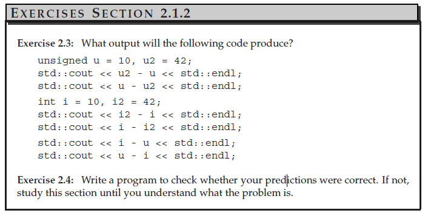]

**ex2.3**

32, 294967264, 32, -32, 0, 0

**ex2.4**
```c++
#include<iostream>

int main()
{
    unsigned u = 10, u2 = 42;
    std::cout << u2 - u << std::endl;
    std::cout << u - u2 << std::endl;
    int i = 10, i2 = 42;
    std::cout << i2 - i << std::endl;
    std::cout << i - i2 << std::endl;
    std::cout << i - u << std::endl;
    std::cout << u - i << std::endl;
}
```
the output is :


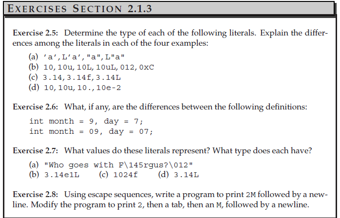

**ex2.5**

(a) 'a' : char, L'a' : wchar_t, "a": string, L"a" : wchar_t string

(b) 10: int, 10u: unsigned int, 10L: long. 10uL: unsigned long, 012: octal, 0xC: hex

(c) 3.14: double, 3.14f: float(single precision), 3.14L: long double

(d) 10: int, 10u: unsigned int, 10.: double, 10e-2: double

**2.6** 

Second one would cause error: because 9 is invalid in octal constant

**2.7**

(a)"Who goes with Fergus?" beacuse ASCII code of 0145(101) is 'e', 0012(10) is EOL(\n) . String

(b)31.4 , Long double

(c)error, int cannot use 'f' to cast

(d)3.14 , Long Double

**2.8**
```cpp
#include<iostream>

using namespace std;
int main(){
    // cout << "\062\115\n";

    cout << "\062\137\115\n";
    return 0;
}
```
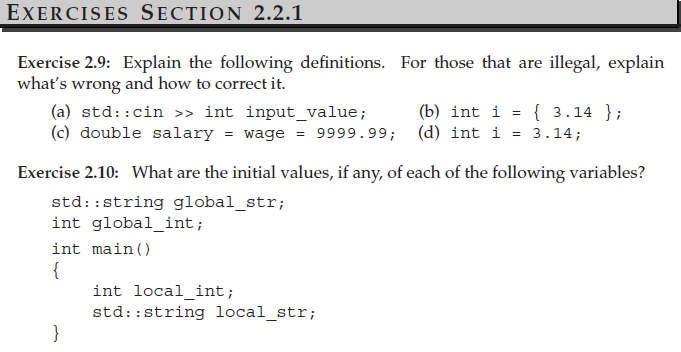

**2.9**

(a) It is not possible to create a variable inside a cin statement because variable declarations must be done separately.

correct version:
```cpp 
int input_value;
cin >> input_value; 
```

(b)Type casting is not allowed during list initialization.

correct version:
```cpp
int i = 3.14;
```

(c) The statement `wage = 9999.99` is an **assignment**. Therefore, if wage had not been declared, this would result in an error.

correct version:
```cpp
double wage;
double salary = wage = 9999.99;
```

(d) This is legal.

**ex2.10**

global_int = 0   
global_str = local_str = "" (empty string)  
local_int = 4201179 (It might be the last used value.)  
local variable without initialization will be unexpected value. 

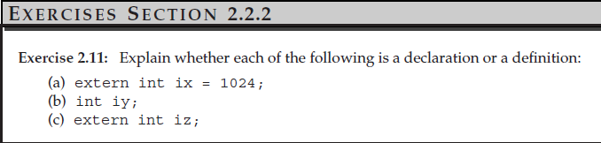
**ex2.11**  
(a) declaration and definition  
(b) declaration and definition  
(c) declaration without definition

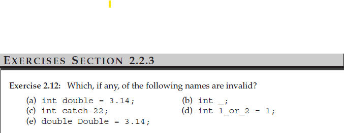
**ex2.12**  
(a), (c), (d)

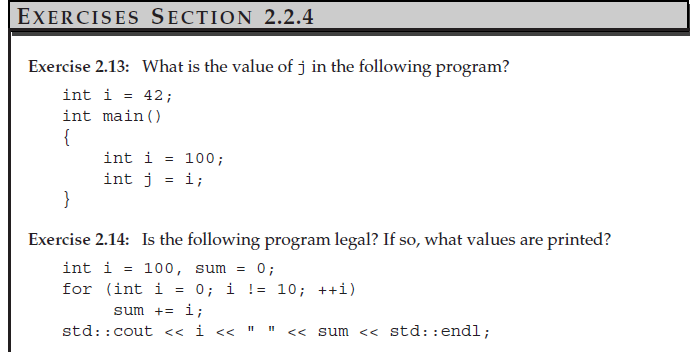
**ex2.13**  
100  
**ex2.14**
yes, 100 55
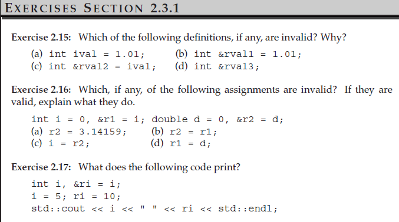
**2.15**  
(a) yes, it's a int object definition  
(b) invalid
(c) yes, it refer to ival  
(d) invalid, reference must be initialized.  

**ex2.16**  
(a) valid, it assign 3.14159 to the object 'd'   
(b) valid, it assign r1 to reference r2  
(c) valid, it assign the value of r2 to integer object i  
(d) valid, it assign the object d to the reference r1  

**ex2.17**  
10 10  

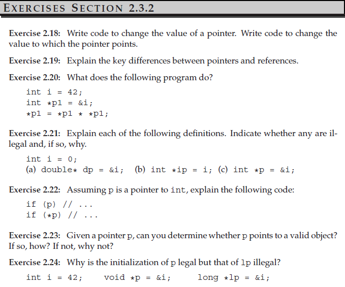  
**2.18** 
```cpp
#include<iostream>

using namespace std;

int main(){
    int num = 10;
    int *p = &num;
    
    cout << "the value pointed by the pointer is: " << *p << endl;
    //Change the value which is pointed by the pointer
    *p = 100;
    cout << "After the operation" << endl;
    cout << "the value pointed by the pointer is: " << *p << endl;

    cout << "the value of the pointer is: " << p << endl;
    //Change the value of the pointer
    p += 4;
    cout << "After the operation" << endl;
    cout << "the value of the pointer is: " << p << endl;    
}
```

**2.19**  
Pointer: A pointer is an object that stores the address of an existing object as its value.

Reference: A reference is simply an alias for an existing object.

**2.20**  
Create a pointer points to i, and change the value of i from 42 to 42 * 42

**2.21**  
(a)x,different type (b)x, cannot assign an integer to a pointer even if its value is 0(it's legal to assign 0 to a pointer, it means null)(c)o, p is pointing to i

**2.22**
if(p):以p裝的address做判斷，若是Null pointer則false, 其他則True  
if(*p):以指向的物件的值做判斷

**2.23**  
Yes, 用if(p)，假如回傳True則他是指向有效位址，即使有可能undefined(指向沒有被define/使用的位址)

**2.24**  
void指針可以指向各種物件，其意義為存放物件的記憶體位址而非存取他，long指針只能存放long type的物件。

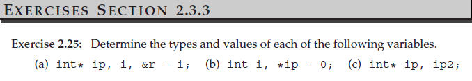
**2.25**  
(a) ip: integer pointer, i: integer, r: reference of integer i  
(b) i: int, ip: integer pointer points to null  
(c) ip: integer pointer, ip2: integer

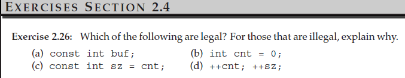
**2.26**  
(a) illegal, should be initialized  
(b) legal  
(c) legal, it's equivalent to `const int sz = 0;`
(d) illegal if sz is a const, it cannot be modified